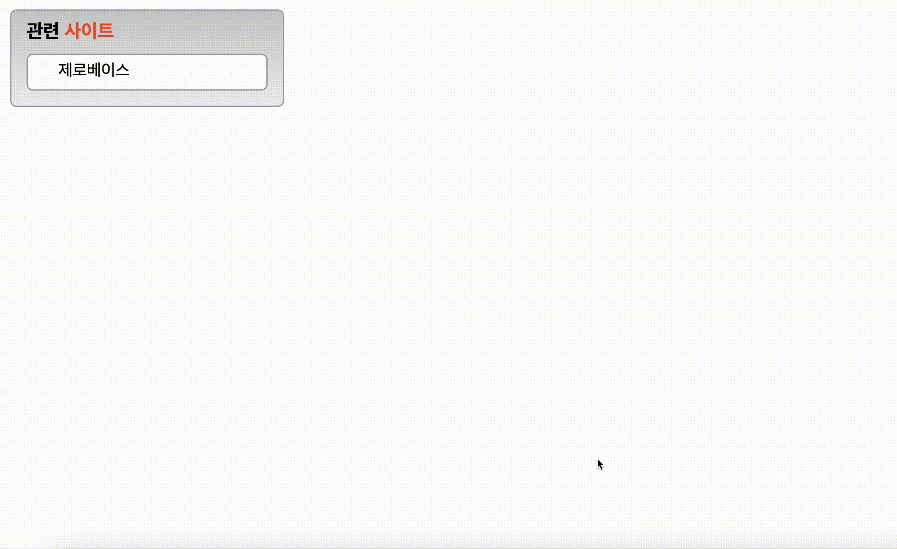

# Mission-03

## General Info

**_transition 과제_**

- transition 실습을 위한 과제 파일은 mission-03/transition.html 파일과 mission-03/transition.css 파일을 생성 후 각각 마크업과 스타일을 작성한다
- 관련 사이트는 제목으로 각각 항목은 링크로 구현한다.
- 링크 목록은 5개이며 CSS를 사용하여 화면에 1개의 목록만 보이도록 구현한다.
- 목록에 마우스를 올리면 5개의 목록이 펼쳐지도록 구현한다.
- transition 속성을 활용하여 애니메이션 효과를 적용한다.

## Result

## Description

- HTML
  : Section > aside > div > h3 > ul 순으로 마크업하여 리스트 형태로 구성하였습니다.

- CSS
  - 주어진 조건대로 transition을 사용해 드롭다운 형태 메뉴를 구성하였습니다. ul 태그 클래스에 transition을 높이와 padding에 각각 주었고, padding은 height가 늘어난 이후 시작되도록 delay를 0.5s 주었습니다.
  - li 중 첫번째 요소 padding이 다른 자식 요소보다 큰 값임을 시안에서 확인 했기 때문에 li:first-child에 더 작은 padding 값을 주고 hover된 이후 같은 padding 값을 주도록 설정하였습니다.
