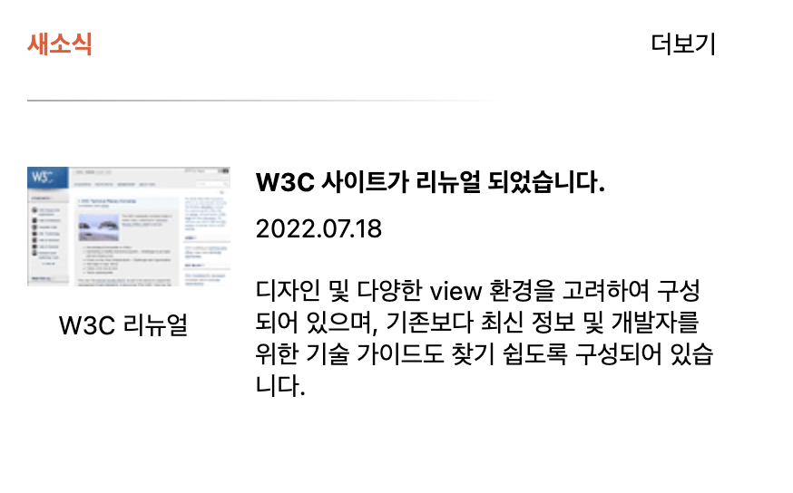

# Mission-04

## General Info

**_Grid 과제_**

- Grid를 활용해 웹카페 내 새소식 섹션을 구성한다.

## Result

## Description

- HTML

  - Section > h3 > div > a > figure > ul 태그순으로 마크업하였습니다.
  - 새소식 제목 아래 선을 구현하기 위해서 div태그를 사용하였으며, aria-label로 구분선 처리하였습니다.

- CSS
  - grid-template-rows: repeat(8, 1fr);
    grid-template-columns: repeat(8, 1fr);
    gap: 18px;
    로 구획을 설정하여 레이아웃을 조정하였습니다.
  - 구획 레이아웃 배치 후 간격 조정을 위해 padding을 주었습니다.
  - 구분선의 gradient효과를 넣어 사라지는 것 처럼 구현하였습니다.
