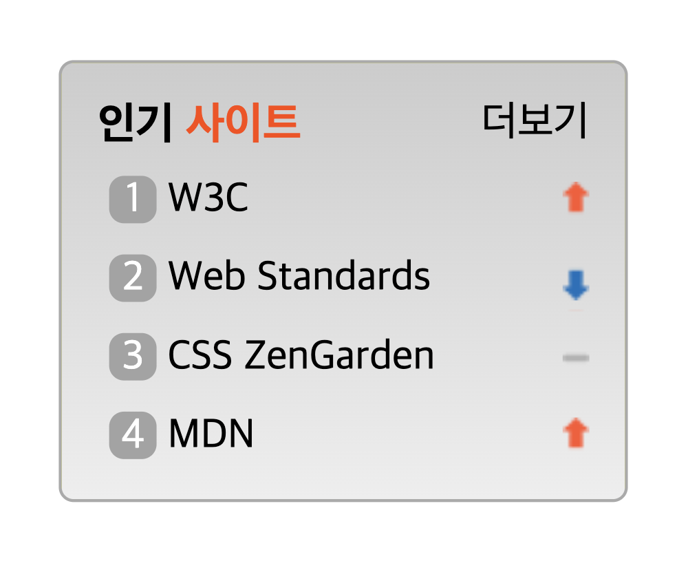

# Mission-05

## General Info

**_Sprite 과제_**

- Sprite를 활용해 rank img에서 필요한 부분만 잘라 인기 사이트 영역을 구성한다.

## Result

## Description

- HTML

  - Div > Section > h2 > ol > li, a 태그순으로 마크업하였습니다.
  - 순위별 사이트 정보 li에 어느 영역을 클릭하든 링크를 통해 넘어갈 수 있도록 구현하였으며, 숫자는 span 태그 안에 넣어 보더와 배경 이미지로 시안과 같은 효과를 만들었습니다.

- CSS
  - 더보기를 우측 상단에 배치하기 위해 부모 요소인 div에 position relative를 주고, 더보기에는 position absolute로 지정해 기준 위치를 부모 요소 div로 설정해 top, right 좌표를 지정했습니다.
  - sprite class를 줘 이미지를 불러왔고, 순위 상승, 하락, 동률에 위치한 이미지의 좌표를 찾아 설정하였습니다.
